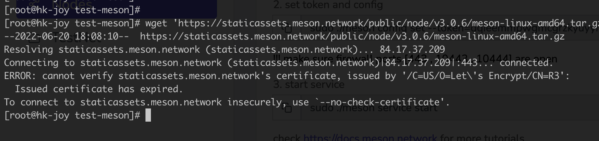

# 🌱 FAQ

[[toc]]

## What is Meson Network?

It is a bandwidth trading platform built on blockchain. We gather the idle bandwidth (and space) from the distributed servers worldwide, offering the servers’ suppliers the tokens as rewards, and helping speed up the streaming media.

## Who will have application requirements for Meson Network?

- people who have servers with idle bandwidth (and space) that are much wasted.
- people who want to speed up their websites at a low price to users worldwide.
- people who want to obtain some files, pictures, or videos from the Internet, but it is too slow because of the regional transmission restrictions or somehow.

We don't recommend personal computers' users to install Meson yet. It is a rigmarole.

## How to prevent the scenario where terminal users used IP pools to fake a large amount of access requests and maliciously earn tokens?

Our token economy is a bandwidth renting model which will not incentivize usage.

## What would happen if users used Meson to cache illegal content?

Meson.Network will deploy AI system to detect the illegal content according to the rule in different countries.

## How to deal with cheating terminal nodes that do not transmit data or transmit wrong data?

All terminal nodes need to stake tokens on mainnet, once cheating behaviors are discovered by meson validators, penalties will be given out to these nodes.

## What is the basic requirement to do mining?

You need a server with at least 40GB storage and a public stable static ip is required during mining.

## Why choose Meson Network?

- Cheap - Make the best use of idle resources
- Fast - We have many nodes around the world to help you accelerate
- Stable - Files have multiple backups, and Meson could deliver your files well
- Win - Win for server owners and content owners

## Where is the blockchain needed in the project?

- With the help of blockchain mining, everyone can join our network rather than having a meeting with the salesperson or signing any contract.
- Token mining rules will be programmed on the chain.
- The future plans will be voted on the chain.
- Token will be distributed on decentralized infrastructure, so everyone can literally own it and trade it.
- We believe blockchain is such powerful that we can have the chance to build the world's biggest marketplace. It's crazy but it is just like any other unbridled achievement ^^

## What is the difference in the current testing period?

All the Testnet Tokens will be mapped to 1% of the MainNet Tokens. According to Token, there will be 100,000,000 initial Meson Tokens, of which there will be 1,000,000 Tokens are used as the exchange of TestNet Tokens.

Your MainNet Tokens = (Your TestNet Tokens / All TestNet Tokens) * (1% * All MainNet Tokens) = (Your TestNet Tokens / All TestNet Tokens) * 1,000,000

>For example, let's assume there will be total 160,000,000 TestNet Tokens at last, and you have 2,000,000 TestNet Tokens that time, then you will get (2,000,000 / 160,000,000) * 1,000,000 = 125,000 MainNet Tokens.

## How many TestNet Tokens will be distributed?

It is determined by the date when Meson will close the TestNet and launch into the MainNet. As a result, it is uncertain yet.

Currently, there are more and more miners and nodes joining. As huge amount nodes join in, Meson Project will start a community vote to decide the token distributed amount function(curve) of TestNet. So that while protecting the interests of existing miners to some extent, it could also increase the income of new entrants.

## Why does Meson choose expensive Ethereum?

Meson supports Ethereum as the first infrastructure layer to ensure the most significant ecosystem in crypto. ERC20 is the most adopted standard, it makes sure everything works fine and has the most compatible situation. Yes, the problem exists in the gas area, so supporting more infra like Arweave-smartweave, Solana, Polygon, ZK-Rollup is onboarding.

## Do I have to exchange my test tokens?

NO.

A very important reason why they are currently test tokens is to make sure everything goes smoothly step by step. You don't have to exchange your test tokens and this is not even recommended if you care much about the gas fee. However, if you would like to save your test tokens on some blockchain to keep them in another way, doing the exchange to Ethereum Network would be a nice option for you.

## Can I trade(transfer) my test tokens after exchanging them to Ethereum?

Not yet.

The functions of transfer for Meson Test Tokens on Ethereum are locked. After the double check of the contract safety, the transfer functions will open to the public.

For more details, please refer to [Ethereum Contract Source Code for Meson Test Tokens](https://etherscan.io/address/0x318b13467537f58890002847fe71eb2a74b6a5a5#code).

## Wget meson_cdn-linux-amd64.tar.gz --no-check-certificate error?



Install ca-certificates package

```bash
sudo yum update -y && yum install -y ca-certificates -y
```

- [2.8 HTTPS (SSL/TLS) Options - Documentation](https://www.gnu.org/software/wget/manual/html_node/HTTPS-_0028SSL_002fTLS_0029-Options.html)

## How to changing RedHat SELinux states?

SELinux can run in one of three modes: enforcing, permissive, or disabled.

***Enforcing*** mode is the default, and recommended, mode of operation; in enforcing mode SELinux operates normally, enforcing the loaded security policy on the entire system.

In ***Permissive*** mode, the system acts as if SELinux is enforcing the loaded security policy, including labeling objects and emitting access denial entries in the logs, but it does not actually deny any operations. While not recommended for production systems, permissive mode can be helpful for SELinux policy development and debugging.

***Disabled*** mode is strongly discouraged; not only does the system avoid enforcing the SELinux policy, it also avoids labeling any persistent objects such as files, making it difficult to enable SELinux in the future.

Open the `/etc/selinux/config` file in a text editor of your choice, for example:

```bash
vi /etc/selinux/config
```

Configure the `SELINUX=permissive` option:

```bash
# This file controls the state of SELinux on the system.
# SELINUX= can take one of these three values:
#       enforcing - SELinux security policy is enforced.
#       permissive - SELinux prints warnings instead of enforcing.
#       disabled - No SELinux policy is loaded.
SELINUX=permissive
# SELINUXTYPE= can take one of these two values:
#       targeted - Targeted processes are protected,
#       mls - Multi Level Security protection.
SELINUXTYPE=targeted
```

Restart the system:

```bash
reboot
```

After the system restarts, confirm that the `getenforce` command returns `Permissive`:

```bash
$ getenforce
Permissive
```

- [🪄 Changing SELinux states and modes - Red Hat Documentation](https://access.redhat.com/documentation/en-us/red_hat_enterprise_linux/8/html/using_selinux/changing-selinux-states-and-modes_using-selinux)
- [SELinux states and modes - Red Hat Documentation](https://access.redhat.com/documentation/en-us/red_hat_enterprise_linux/8/html/using_selinux/getting-started-with-selinux_using-selinux) 
- [Ensuring the required state of selinux](https://access.redhat.com/documentation/en-us/red_hat_enterprise_linux/8/html/configuring_basic_system_settings/assembly_configuring-system-security_configuring-basic-system-settings#proc_ensuring-the-required-state-of-selinux_assembly_configuring-system-security)

## How to Forward Ports on Your Router?

This step is important for your own personal computer to run Meson.

You could search ——

"Port Forwarding" + [Your Router Brand] at YouTube/Google/etc...

That is to change the configuration to tell your router this IP is connected with your PC so that Meson could find your device(server) through your router.

References: [https://en.wikipedia.org/wiki/Network_address_translation](https://en.wikipedia.org/wiki/Network_address_translation)

<iframe width="100%" height="315" src="https://www.youtube.com/embed/2G1ueMDgwxw" title="YouTube video player" frameborder="0" allow="accelerometer; autoplay; clipboard-write; encrypted-media; gyroscope; picture-in-picture" allowfullscreen></iframe>