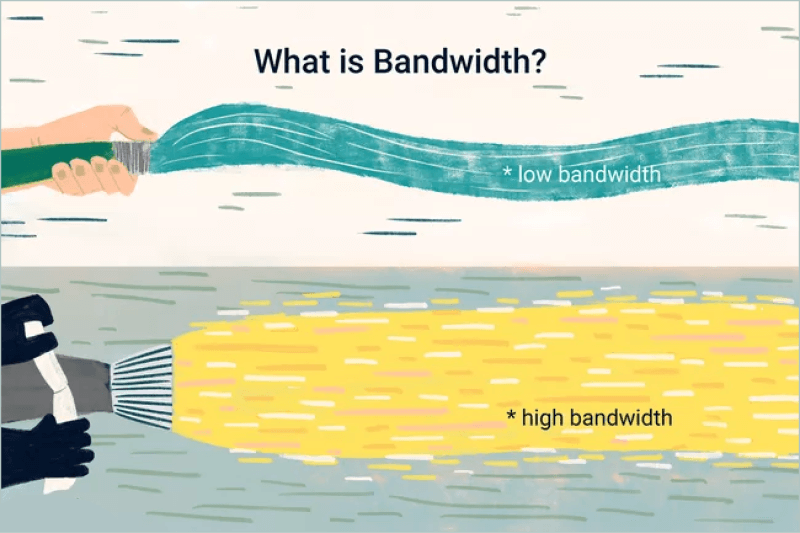
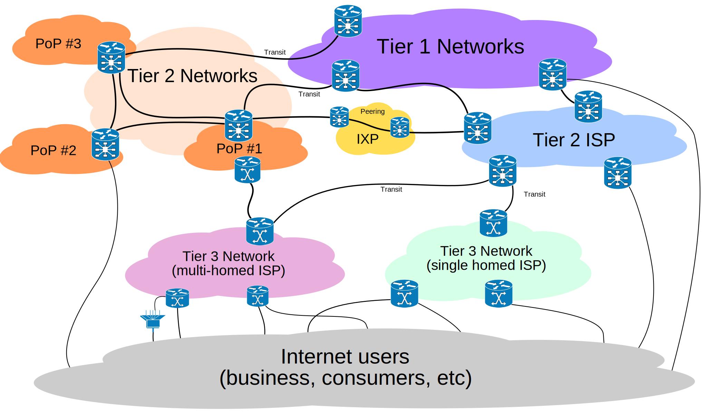

# 🧱 Glossary

### Bandwidth

Bandwidth is often mistaken for internet speed when it's actually the volume of information that can be sent over a connection in a measured amount of time – calculated in megabits per second (Mbps).

- [Bandwidth (computing) - Wikipedia](https://en.wikipedia.org/wiki/Bandwidth_(computing))
- [What Is Bandwidth? Definition, Meaning, and Details](https://www.lifewire.com/what-is-bandwidth-2625809)

### CDN (Content Delivery Network)

A content delivery network (CDN) refers to geographically distributed large network of proxy servers and data centers. CDN is to provide high availability and good performance by distributing content spatially relative to end users. Companies across different verticals employ CDN to deliver media (such as video, audio and streaming), HTTP content, and download files.

### HTTP & HTTPS

Hypertext Transfer Protocol (HTTP) is an application-layer protocol for transmitting hypermedia files, such as HTML. It was designed for communication between web browsers and web servers. HTTP is the foundation of data communication for the World Wide Web, where hypertext documents (e.g. hyperlinks) can be accessed by users easily. Hypertext Transfer Protocol Secure (HTTPS) is an extension of HTTP. It is used for secure communication over a computer network, and is widely used on the Internet. In HTTPS, the communication protocol is encrypted using Transport Layer Security.

Differences:

- HTTP is unsecured while HTTPS is secured.
- HTTP operates at application layer, while HTTPS operates at transport layer and uses TLS/SSL certificate to ensure authentication.

### Static IP address

A static IP address is simply an address that doesn't change. Once your device is assigned a static IP address, that number typically stays the same until the device is decommissioned or your network architecture changes. Static IP addresses generally are used by servers or other important equipment.

Static IP addresses are assigned by Internet Service Providers (ISPs). Your ISP may or may not allocate you a static IP address depending on the nature of your service agreement. We describe your options a little later, but for now assume that a static IP address adds to the cost of your ISP contract.

A static IP address may be IPv4 or IPv6; in this case the important quality is static. Some day, every bit of networked gear we have might have a unique static IPv6 address. We're not there yet. For now, we usually use static IPv4 addresses for permanent addresses.

#### Advantages of a static IP

There are numerous advantages to using a static IP address. Among these benefits are:

- **Better DNS support**: Static IP addresses are much easier to set up and manage with DNS servers.
- **Server hosting**: If you are hosting a web server, email server, or any other kind of server, having a static IP address makes it easier for customers to find you via DNS. Practically speaking that means it's quicker for clients to get to your websites and services if they have a static IP address.
- **Convenient remote access**: A static IP address makes it easier to work remotely using a Virtual Private Network (VPN) or other remote access programs.
- **More reliable communication**: Static IP addresses make it easier to use Voice over Internet Protocol (VoIP) for teleconferencing or other voice and video communications.
- **More reliable geo-location services**: With a static IP address, services can match the IP address with its physical location. For example, if you use a local weather service with a static IP address you're more likely to get the weather report you need instead of the one for the next city over.

### Dynamic Host Configuration Protocol (DHCP) Reservation

 Static Dynamic Host Configuration Protocol (DHCP) or DHCP Reservation, lets the DHCP server of the router assign the same Internet Protocol (IP) address to a host in your Local Area Network (LAN). This is done by associating one IP address to one Media Access Control (MAC) address. Although it requires additional configuration, employing static DHCP makes it easy to troubleshoot the network. Static DHCP also helps devices on a LAN connect to each other easier. A classic example of using static DHCP is when setting up a web server that is accessible outside the network.

- [Static IP vs DHCP Reservation](https://www.stephenwagner.com/2019/05/07/static-ip-vs-dhcp-reservation/)

### Tier 1 Network

A top-level network on the Internet. There are 16 Tier 1 networks worldwide. In the U.S., AT&T, CenturyLink, GTT, Verizon and the Zayo Group are Tier 1. Germany, U.K, France, Hong Kong, Japan, India, Italy, Spain and Sweden host the non-U.S. networks.

Known as "settlement-free peering," Tier 1 networks are private networks that allow traffic from other Tier 1 networks to transit their backbones without a fee. See peering and IXP.

#### Tier 2 and Tier 3 Networks

Tier 2 networks peer with some networks without fees but pay to reach a large portion of the Internet. Tier 3 networks always pay fees to obtain access to the larger backbones.

- [Tier 1 Network - Wikipedia](https://en.wikipedia.org/wiki/Tier_1_network)

### Decentralized Content Delivery Network (DCDN)

Decentralized Content Delivery Network (DCDN) is a decentralized CDN that empowers original content creators and communities by creating a fair and transparent ecosystem for revenue distribution and media consumption, as well as utilizes a widely dispersed edge node network in order to increase internet performance.

### Arweave

Arweave is a fully decentralized network.All of the connected sites and apps on the Arweave network are what is called the permaweb. 

The permaweb is a parallel to the traditional web, but the content is permanent and the power dynamics put the user in control. This means you won’t be encountering 404s and that you can be sure that once you’ve found a page on the permaweb, it will still be there years later.

- [The Arweave Glossary: Key Terms For Arweave Beginners](https://arweave.news/arweave-glossary/)

### IPFS

The InterPlanetary File System (IPFS) is a protocol and peer-to-peer network for storing and sharing data in a distributed file system. IPFS uses content-addressing to uniquely identify each file in a global namespace connecting all computing devices.

### Filecoin

Filecoin is a peer-to-peer network that stores files, with built-in economic incentives to ensure files are stored reliably over time.

In Filecoin, users pay to store their files on storage providers. Storage providers are computers responsible for storing files and proving they have stored the files correctly over time. Anyone who wants to store their files or get paid for storing other users’ files can join Filecoin. Available storage, and the price of that storage, is not controlled by any single company. Instead, Filecoin facilitates open markets for storing and retrieving files that anyone can participate in.

#### IPFS and Filecoin

Filecoin and IPFS are complementary protocols for storing and sharing data in the distributed web. Both systems are free, open-source, and share many building blocks, including data representation formats (IPLD) and network communication protocols (libp2p). While interacting with IPFS does not require using Filecoin, all Filecoin nodes are IPFS nodes under the hood, and (with some manual configuration) can connect to and fetch IPLD-formatted data from other IPFS nodes using libp2p. However, Filecoin nodes don’t join or participate in the public IPFS DHT.

- [What is Filecoin - Filecoin Docs](https://docs.filecoin.io/about-filecoin/what-is-filecoin/)