# 🔆 MCDN 101

MCDN is an Enterprise-Level Hybrid CDN service released by meson network, which not only supports traditional Internet applications, but is also optimized for Web 3 application construction.

[[toc]]

## Register MCDN

Register and Login to MCDN dashboard

[https://m-cdn.io/register](https://m-cdn.io/register)

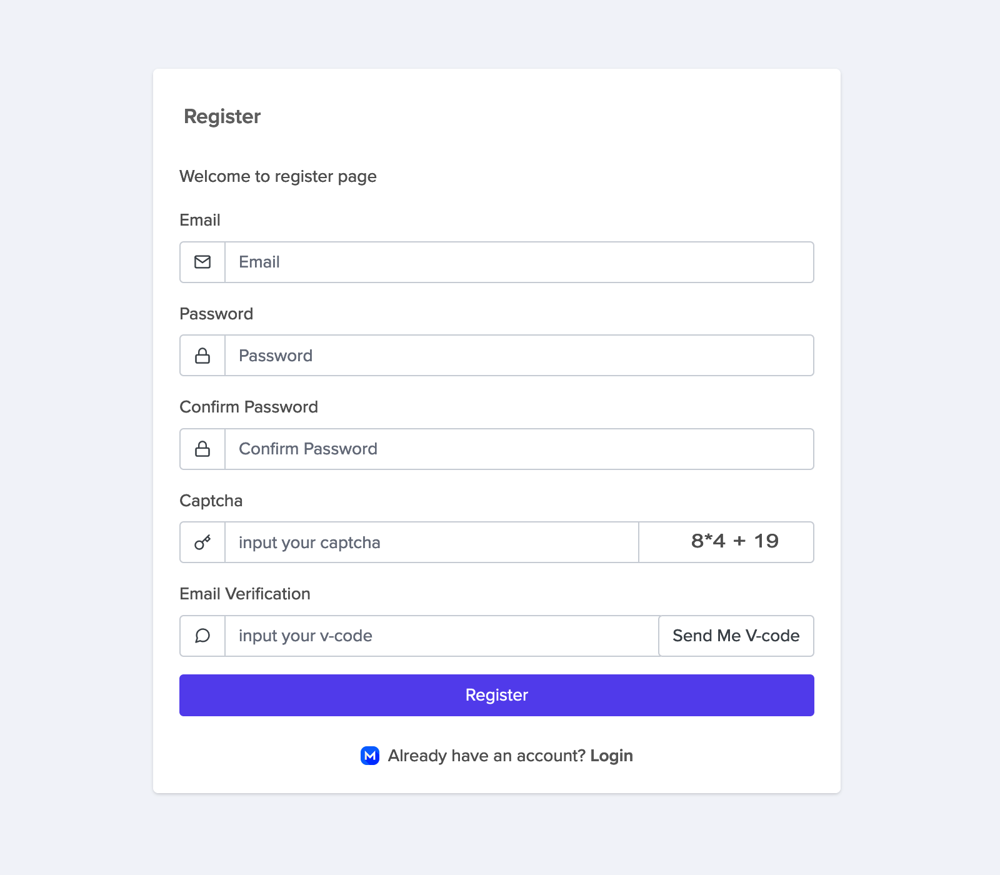

## Crate Pull Zone

To set up a MCDN Pull Zone, follow the steps outlined below:

1. In the left navigation sidebar click ****Pull Zone****. Click ****Crate Pull Zone****.

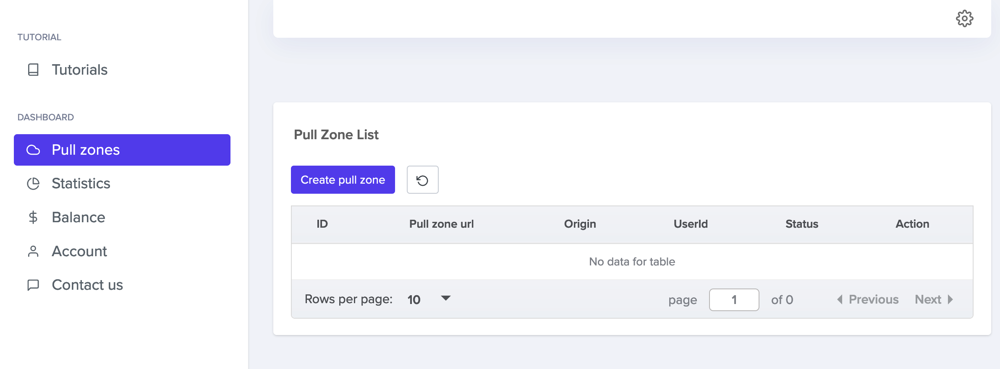

2. Define the **Origin URL** (e.g. [https://mesondemo.github.io](https://mesondemo.github.io/)).

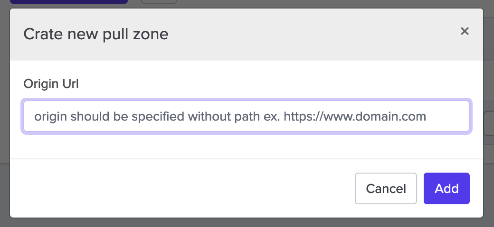

3. Click Add.

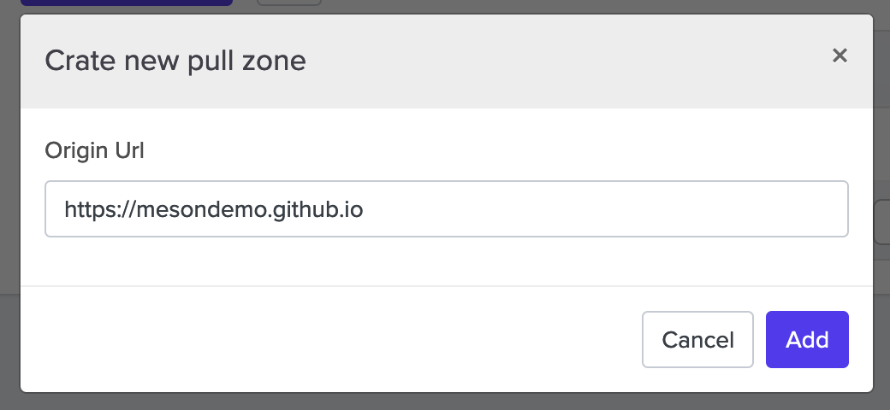

4. Wait for global **deployment** to finish, click settings and set up mcdn

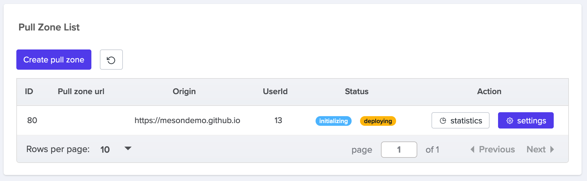

- **initializing**: Start Global deployment
- **deploying**: Fully Global deployment takes about 1-5 minutes.
- **active**: Global deployment complete

## Use a Custom domain

1.  Click**Add domain**

When you create a new site on MCDN, it’s instantly secured at the Default Domain URL (for example, `https://rhwrlulrle.m-cdn.io`). If you add a **Custom domain**, we will automatically provision a certificate with [Let’s Encrypt](https://letsencrypt.org/), enabling HTTPS on your domain. Certificates are generated and renewed automatically as needed.

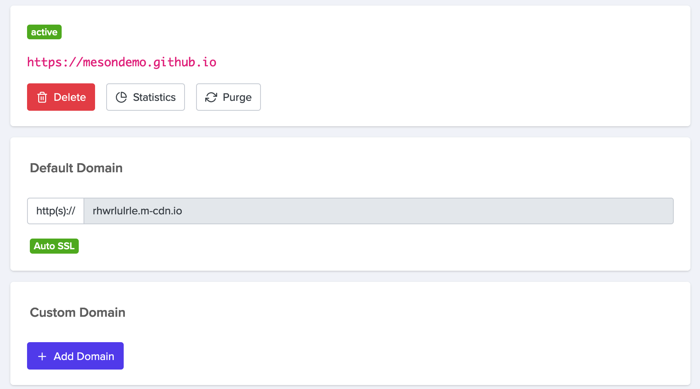

2. input your domain (e.g. mesondemo.dcdn.me). 

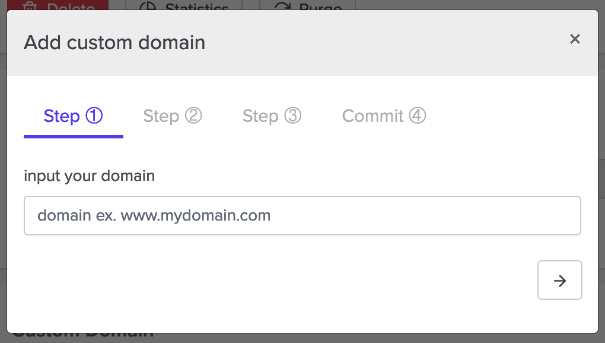

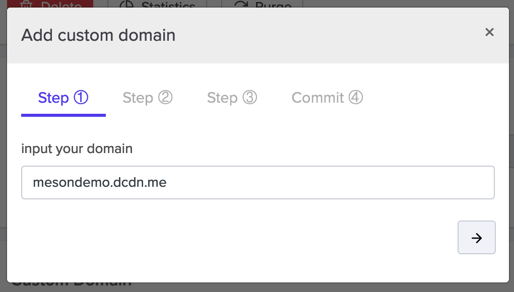

3. Verifying your custom domain

Follow the instructions under "Add a DNS `CNAME` record" to create the `CNAME` record with your domain hosting service.Wait for your DNS configuration to change, this may be immediate or take up to 24 hours.After confirming that your DNS configuration has updated, you can verify the domain. 

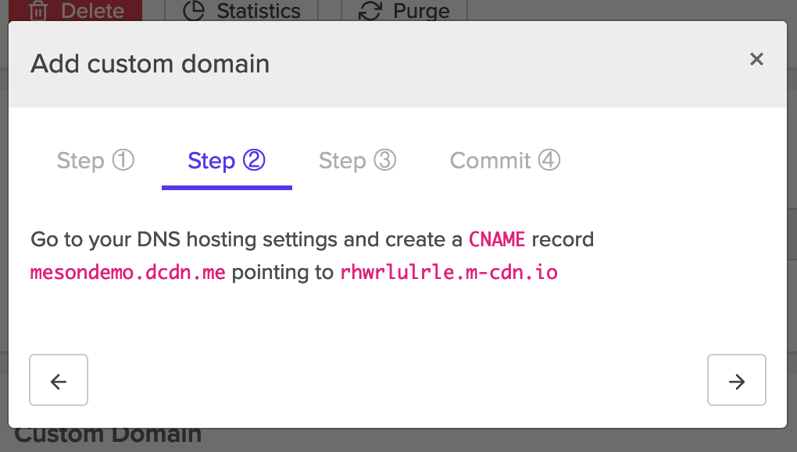

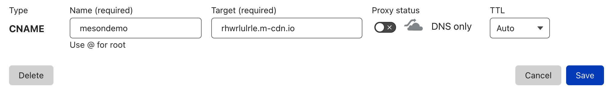

4. Installing SSL Certificates

MCDN offers two different ways of providing a certificate for HTTPS.

- [Let’s Encrypt](https://letsencrypt.org/) **certificates** are offered to all mcdn sites for free.
- **Custom certificates** are a way for you to provide a certificate that matches your specifications — things like a wildcard certificate or an Extended Validation (EV) certificate.

5. Commit & Crate Domain

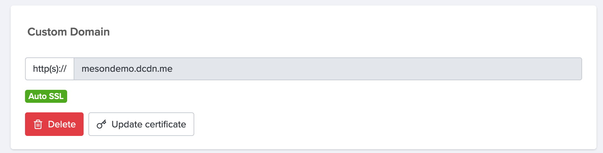

Settings Allowed Referrers & Blocked Countries, Click Commit update to save

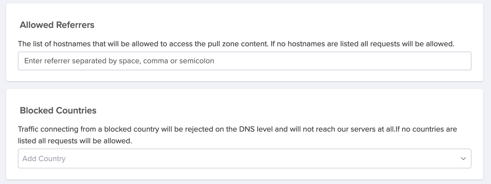