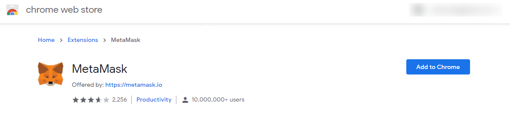
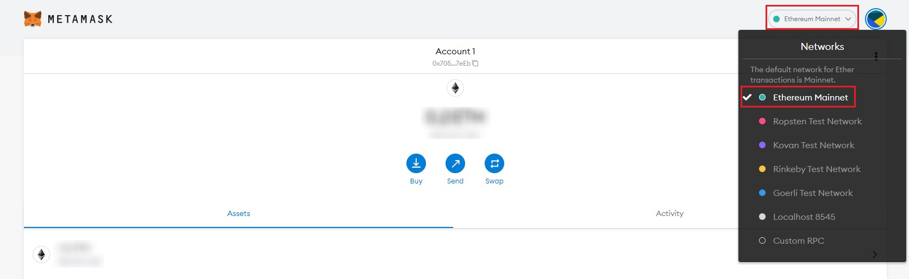
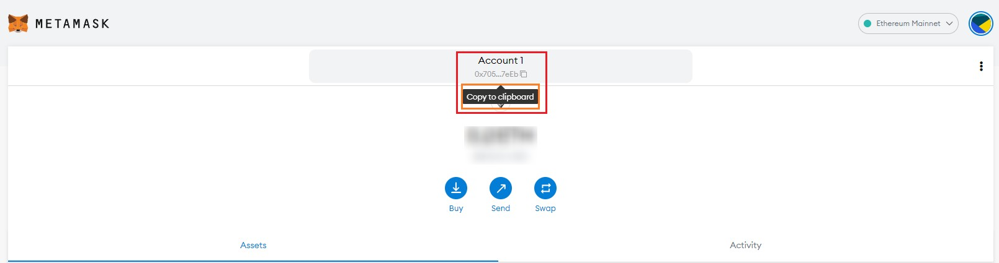
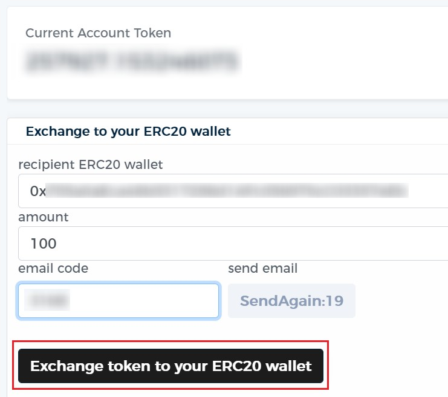
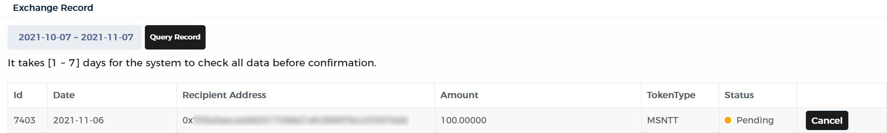
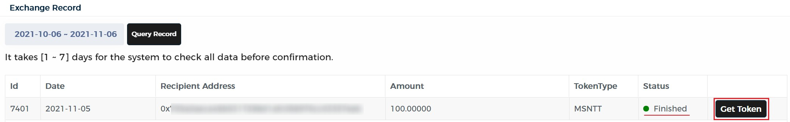
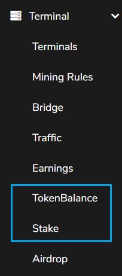
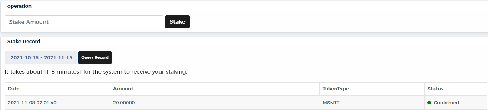

# Meson to MetaMask 

The Meson Test Token is now boarding to Ethereum.

## Install MetaMask

[MetaMask](https://metamask.io/) is a software cryptocurrency wallet. It allows users to access their Ethereum wallet through a browser extension or mobile app, which can then be used to interact with decentralized applications. Here MetaMask is recommended for you to withdraw or deposit Tokens of Meson.

For example, if you are using Chrome, please install [MetaMask as an extension](https://chrome.google.com/webstore/detail/metamask/nkbihfbeogaeaoehlefnkodbefgpgknn).

**Switch to Ethereum Mainnet**

Meson is an ERC20 contract. Make sure to switch to Ethereum Mainnet.

**Prepare the gas fee**

Get some ETH to afford the gas fee for the transition.

## Exchange

### Apply

Open the dashboard of the website of meson, switch to the page of TokenBalance, Copy your Ethereum wallet address from MetaMask you want to exchange your meson test token to, fill in the amount of Token you would like to exchange to, and the email verification code, then please click the button "Exchange token to your ERC20 wallet".

### Wait

After applying the exchange, you will see a record where your status is pending, it may take 1 to 7 days for Meson teams to approve (the time is for merging all applications to give airdrops together.

Before the approval, you could cancel this operation or exchange MSNTT again with a different wallet or amount.

### Claim

After the approval, the status will be "Finished", now you can click "Get Token" to trigger the contract interaction via MetaMask to withdraw your exchange.

You have to pay the gas fee for every operation at the Ethereum network, unfortunately, it is quite expensive yet. It may take about 1 to 15 minutes to confirm this operation. And then, you could see the status of your exchange turns to Finished.

### Stake

On the Dashboard of Meson.network, there are "TokenBalance" and "Stake" pages. Doing the EXCHANGE at "TokenBalance" transfers your tokens from the database of Meson to the blockchain of Ethereum. And doing the STAKE at "Stake" transfers your tokens from the blockchain of Ethereum back to the database of Meson.

Notification: As mentioned above, the default status of your test tokens is already STAKE. However, you can't get any earnings for the status of Stake yet. So please do not exchange your Meson Test Tokens if you wish to stake them, as it would just cost two times your Ethereum gas fee while back to square one.

If you want to transfer your Meson Test Tokens back to the database of Meson showing on the dashboard of the Meson website. You could stake them back.

Metamask is also used for this operation, input the stake amount and click "stake", you will be able to receive this transfer in 1 to 15 minutes after paying the Ethereum gas fee.

