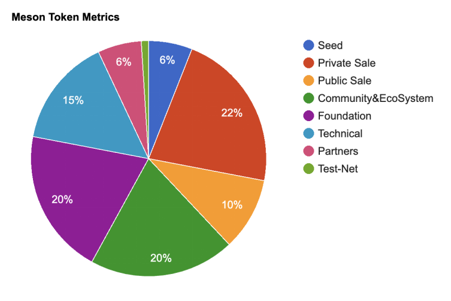
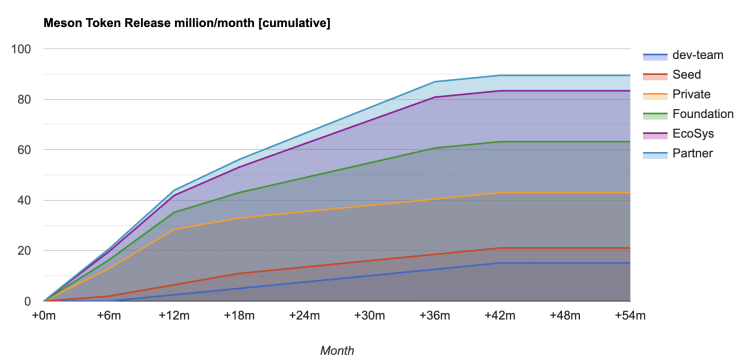
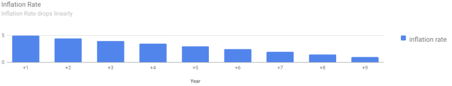
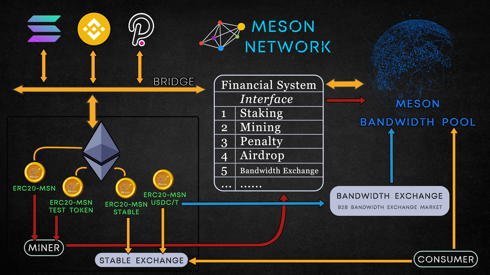

# $Meson 🐢

Meson is Meson.Network's incentive and governance token. It has four primary functions:

- For rewarding miners
- For staking by miners
- As payment by users
- Protocol governance
- The tokens are distributed to network terminals (miners) as rewards for providing server resources.

Currently, there are no benefits for staking the tokens as the functions of transfer for Meson Test Tokens on Ethereum are locked. Users of the services will pay in Meson Tokens to get additional bandwidth. These tokens are then rewarded to miners through the repurchase and destruction of tokens.

Meson allows its Token holders to vote on development or modification of parameters of the protocol.

## Token Details

- Token Ticker: Meson(TBD)
- Initial Supply: 100,000,000 Meson

## Token Distribution

- Seed Token Sale: 6,000,000 Meson (6%)
- Private Token Sale: 22,000,000 Meson (22%)
- Public Token Sale: 10,000,000 Meson (10%)
- Community & Ecosystem: 20,000,000 Meson (20%)
- Foundation Reservation: 20,000,000 Meson (20%)
- Technical Team: 15,000,000 Meson (15%)
- Partners: 6,000,000 Meson (6%)
- Test-Net Mapping: 1,000,000 Meson (1%)

## Token Unlock Plan

- 10% of the sold tokens in the Public Round are directly circulating.
- Tokens reserved for the technical team are fully locked initially and will be linearly unlocked monthly over 3 years starting from the 6th month after the MainNet goes live.
- Tokens reserved for Foundation, Partners, and Community are fully locked and will be linearly unlocked monthly over 3 years after the MainNet goes live.
- Tokens sold in the Seed Round will be linearly unlocked monthly over 18 months after the MainNet goes live.
- Tokens sold in the Private Round will be linearly unlocked monthly over 12 months after the MainNet goes live.
- TestNet Tokens will be mapped to 1% of all the tokens on MainNet and are directly circulating after the MainNet goes live.

## Token Functions

- Miners get Token rewards after joining the meson network and devoting their server resources.
- Miners can stake meson tokens to accelerate the mining efficiency.
- Clients use meson tokens to accelerate any internet media resource e.g file/images/video/streaming/website etc
- Anyone can use meson tokens for election and voting of on-chain governance/proposals/etc.

## Total Token Inflation

All token inflation comes from mining rewards. The first-year mining inflation rate is 5%. The inflation rate drops 0.5% each year.

## Token Circulation

Miners will get meson tokens as a reward while providing an idle server to meson.network. Miners will reach full mining speed only if they stack meson tokens accordingly. Clients send payments to meson.network while using meson service. All meson tokens can be exchanged at CEX or DEX.

## Testnet Token Contract(MSNTT)

Ethereum Contract Address: 0x318b13467537f58890002847fe71eb2a74b6a5a5

Ethereum Contract: [Source Code](https://etherscan.io/address/0x318b13467537f58890002847fe71eb2a74b6a5a5)