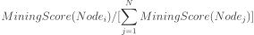
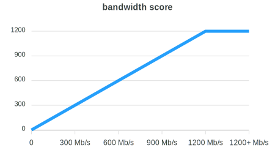
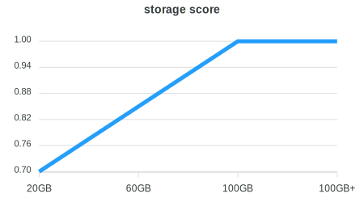
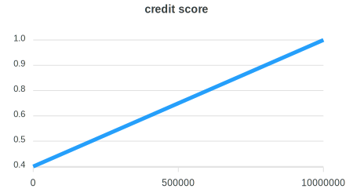

# Mining & Rewards

Who are the most suitable miners for Meson Network?

- Constant bandwidth users
- Static IP for home users
- IoT devices' owners
- Dedicated servers' owners
- IDC servers' (corporation/organization/schools) owners.

They are welcomed to become our most stable terminals suppliers. As a result, by making the most use of these idle resources, it becomes an economical and healthy model according to the blueprint and positioning of Meson Network Project.

## Prerequisite

- A Static(Public) IP or A DHCP Reservation
- Opening the port of the firewall (default: 443, support for custom server ports)
- Providing enough Storage (default minimum requirements: 20G)

## Mining Rules

Please check [miningrules](https://dashboard.meson.network/ming_rules_msntt) for details.

Mining Score = Bandwidth Score * Storage Score * Credit Score

Basically, Bandwidth is the most important related fact for BandwidthScore.

And, Storage Space is necessary to cache the files for StorageScore.

In addition, standing and stable servers will have a higher CreditScore.

Also, there will be some reward adjustments for servers in different regions.

<table>
    <tr>
        <td>Item</td>
        <td>Value</td>
    </tr>
    <tr>
        <td>Network</td>
        <td>TestNet</td>
    </tr>
    <tr>
        <td>Mining Score</td>
        <td>Mining Score = Bandwidth Score * Storage Score * Credit Score</td>
    </tr>
    <tr>
        <td>Percentage of earning of some mining node</td>
        <td></td>
    </tr>
    <tr>
        <td>Bandwidth Score</td>
        <td></td>
    </tr>
    <tr>
        <td>Bandwidth Upper Bound</td>
        <td>Bandwidth score won't increase after bandwidth reaching 1200 Mb/s</td>
    </tr>
    <tr>
        <td>Storage Score</td>
        <td></td>
    </tr>
    <tr>
        <td>Minium Storage Requirement</td>
        <td>20GB</td>
    </tr>
    <tr>
        <td>Credit Score</td>
        <td> If your node is online and stable, the credit will increase gradually until maximum value 10000000
When your node goes offline the credit will decrease gradually until 0.
Makes your node stable to get more token.</td>
    </tr>
    <tr>
        <td>Example</td>
        <td align="left">If your bandwidth is 200Mb/s, "Bandwidth score" will be 200 If you set storage to 60GB, "Storage score" will be 0.85 If your credit is 500000, "Credit score" will be 0.7 Mining score = 200 * 0.85 * 0.7 = 119</td>
    </tr>
</table>

All the Testnet Tokens will be mapped to 1% of the Mainnet Tokens. according to FAQ-Token, there will be 100,000,000 initial Meson Tokens, of which there will be 1,000,000 Tokens are used as the exchange of Testnet Tokens.

**Your Mainnet Tokens = (Your Testnet Tokens / All Testnet Tokens) * (1% * All Mainnet Tokens) = (Your Testnet Tokens / All Testnet Tokens) * 1,000,000**

For example, let's assume there will be total 160,000,000 Testnet Tokens at last, and you have 2,000,000 Testnet Tokens that time, then you will get (2,000,000 / 160,000,000) * 1,000,000 = 125,000 Mainnet Tokens.