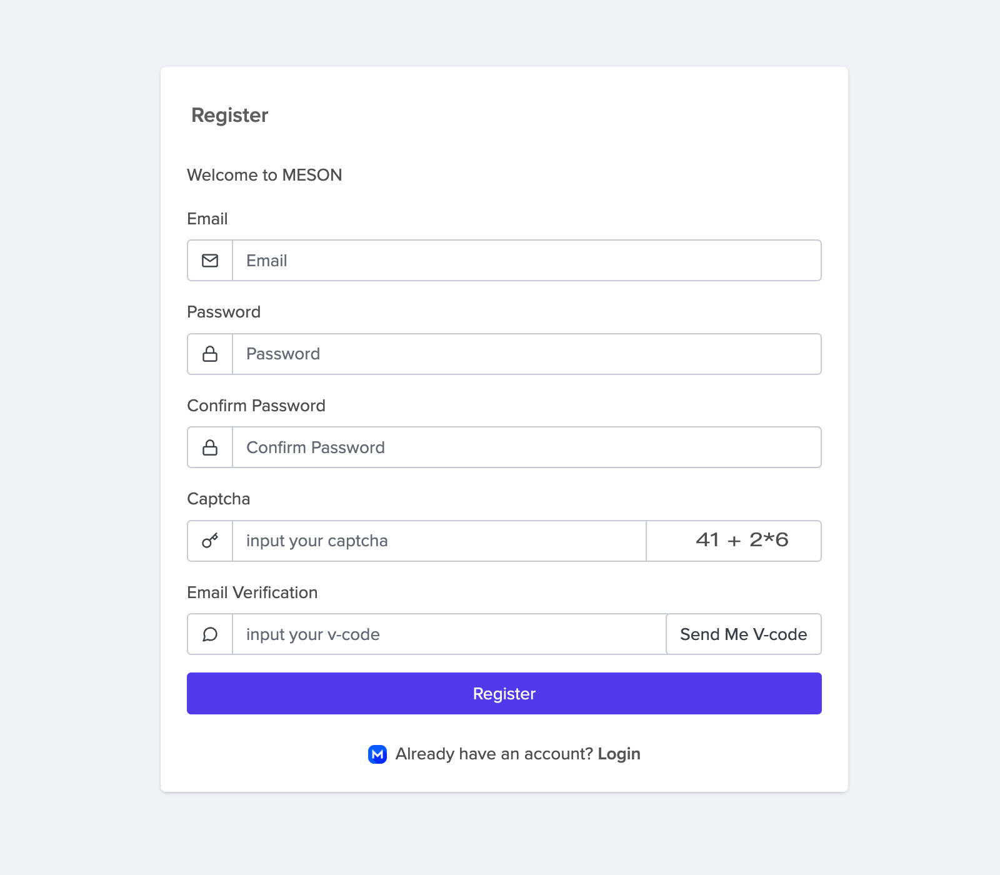
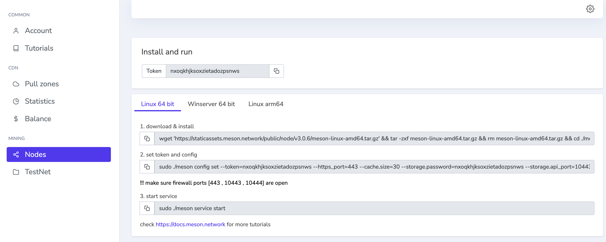
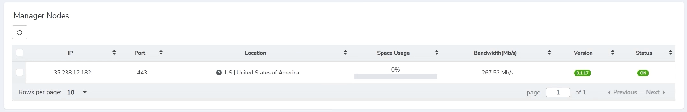

# Run Meson Node 101

[[toc]]

## Deploy Requirements

- A Public(Static/Dynamic) IP or A DHCP Reservation
- Opening the port of the firewall (default: 443, support for custom server ports)
- Providing enough Storage (default minimum requirements: 20G)

## Register

[https://dashboard.meson.network/register](https://dashboard.meson.network/register)



Click the button “Nodes” and you can find out your token and installation tutorial in this page



## How to Install Meson on **Linux ?**

### 1.Download & Install

```bash
wget 'https://staticassets.meson.network/public/meson_cdn/v3.1.x/meson_cdn-linux-amd64.tar.gz' && tar -zxf meson_cdn-linux-amd64.tar.gz && rm -f meson_cdn-linux-amd64.tar.gz && cd ./meson_cdn-linux-amd64 && sudo ./service install meson_cdn
```

::: tip
If you get notifications like "-bash: wget: command not found" telling that you can't use this command, please install wget by using **command** first.
:::

**Ubuntu / Debian:** 

```bash
sudo apt-get update -y && sudo apt-get install wget -y
```

**CentOS / Fedora:**

```bash
sudo yum update -y && sudo yum install wget -y
```

console output:

```bash
$ wget 'https://staticassets.meson.network/public/meson_cdn/v3.1.x/meson_cdn-linux-amd64.tar.gz' && tar -zxf meson_cdn-linux-amd64.tar.gz && rm -f meson_cdn-linux-amd64.tar.gz && cd ./meson_cdn-linux-amd64 && sudo ./service install meson_cdn
--2022-06-18 07:48:10--  https://staticassets.meson.network/public/meson_cdn/v3.1.x/meson_cdn-linux-amd64.tar.gz
Resolving staticassets.meson.network (staticassets.meson.network)... 143.244.60.109
Connecting to staticassets.meson.network (staticassets.meson.network)|143.244.60.109|:443... connected.
HTTP request sent, awaiting response... 200 OK
Length: 48735663 (46M) [application/x-gzip]
Saving to: 'meson_cdn-linux-amd64.tar.gz'

100%[======================================>] 48,735,663  81.2MB/s   in 0.6s   

2022-06-18 07:48:11 (81.2 MB/s) - 'meson_cdn-linux-amd64.tar.gz' saved [48735663/48735663]

2022-06-18 07:48:12 [INFO] using config: /home/ec2-user/meson_cdn-linux-amd64/configs/default.toml
2022-06-18 07:48:12 [INFO] service installed
```

### 2.Set token and config

```bash
sudo ufw allow 443
sudo ./meson_cdn config set --token=your token --https_port=443 --cache.size=30
```

console output:

```bash
$ sudo ./meson_cdn config set --token=your token --https_port=443
2022-06-18 07:59:13 [INFO] using config: /home/ec2-user/meson_cdn-linux-amd64/configs/default.toml
```

We recommend enabling TCP Ports 443  in both directions in your server/router. Check your Router's & Cloud's  instructions on how to open ports 443.

Setting port number

```bash
sudo ufw allow 443              # default is 443, support for custom server ports
```

To get started with port forwarding, check out [https://portforward.com](https://portforward.com/) .

If you want to change the default config, you can use these parameters.

Param List:

```bash
-token=your token              # you can find out your token in nodes page
-https_port=443                # default is 443, support for custom server ports
-cache.size=30                 # at least 20, default is 30, support for custom server ports
-cache.folder=xxxx             # string, cache folder path, could be an absolute path
```

Example:

In the example, I changed the default port to 520, cache size to 20G.

```bash
sudo ufw allow 520
sudo ./meson_cdn config set --token=your token --https_port=520 --cache.size=20 && sudo ./service restart meson_cdn
```

After you modify the config, please restart your node with command  `sudo ./service restart meson_cdn` .

### 3. Start Service

Start the service of Meson Node.

```bash
sudo ./service start meson_cdn
```

console output:

```bash
$ sudo ./service start meson_cdn
2022-06-18 07:59:57 [INFO] using config: /home/ec2-user/meson_cdn-linux-amd64/configs/default.toml
2022-06-18 07:59:57 [INFO] service started
```

After 2-3 minutes, you will have a new terminal record at **terminals open in new node** .



### 4.Check Node Running Status

```bash
sudo ./service status meson_cdn
```

console output:

```bash
$ sudo ./service status meson_cdn
2022-06-18 09:31:39 [INFO] using config: /home/ec2-user/meson_cdn-linux-amd64/configs/default.toml
2022-06-18 09:31:39 [INFO] service status: RUNNIN
```

### 5.Stop & Remove

```bash
sudo ./service stop meson_cdn && sudo ./service remove meson_cdn
```

console output:

```bash
$ sudo ./service stop meson_cdn && sudo ./service remove meson_cdn
2022-06-18 10:18:01 [INFO] using config: /home/ec2-user/meson_cdn-linux-amd64/configs/default.toml
2022-06-18 10:18:01 [INFO] service stopped
2022-06-18 10:18:01 [INFO] using config: /home/ec2-user/meson_cdn-linux-amd64/configs/default.toml
2022-06-18 10:18:01 [INFO] service removed
```

### Commands Reference

```bash
sudo ./service install meson_cdn              # install node
sudo ./service start meson_cdn                # start node
sudo ./service status meson_cdn               # check node running status
sudo ./service stop meson_cdn                 # stop node
sudo ./service remove meson_cdn               # remove node
sudo ./service restart meson_cdn              # restart node
sudo ./meson_cdn log                          # check logs
./meson_cdn -h                                # check help
```